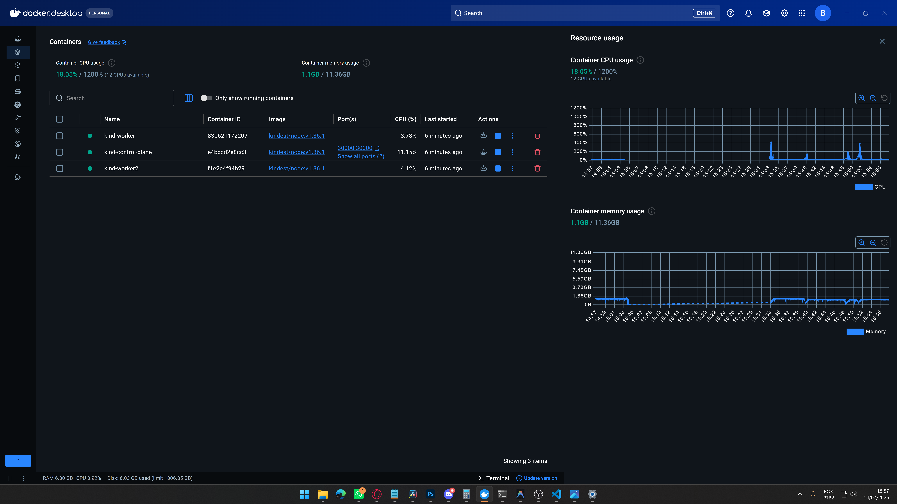
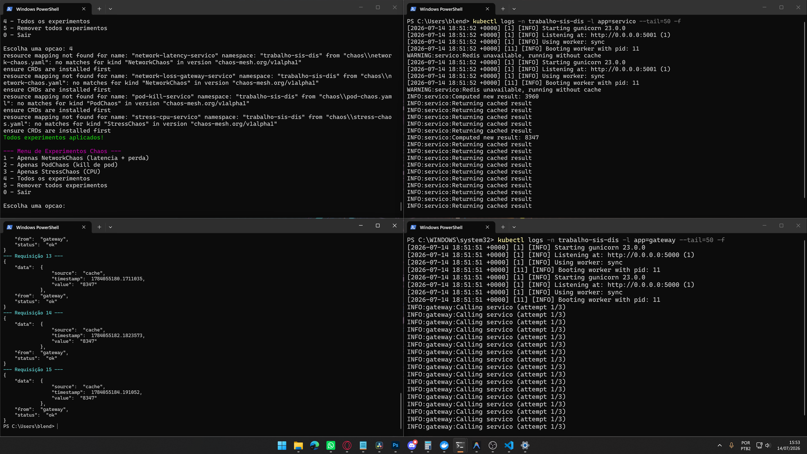

# Relatorio Tecnico de Resiliencia

**Disciplina:** Sistemas Distribuidos - 2026/1
**Professor:** Helder de Amorim Mendes
**Grupo:** Blendhon Pontini Delfino, Jhonatas Vinicius Neri Dos Santos e Maria Clara Gueler Feitani

---

## 1. Arquitetura da Aplicacao

```
[Cliente] --> [Gateway :5000] --> [Servico :5001] --> [Redis :6379]
                      |                   |
                 Circuit Breaker      Cache (Redis)
                   + Retry
                   + Timeout
```

- **Gateway (2 replicas):** Flask + circuito disjuntor, retry, timeout
- **Servico (2 replicas):** Flask + Redis (cache)
- **Redis:** Cache de resultados (TTL 30s)

### Mecanismos de Tolerancia a Falhas

| Mecanismo | Local | Configuracao |
|-----------|-------|-------------|
| Circuit Breaker | Gateway | 3 falhas -> OPEN, recovery 10s |
| Timeout | Gateway | 2s por request |
| Retry | Gateway | 3 tentativas com backoff |
| Replicas | K8s | 2 pods cada servico |
| Liveness/Readiness | K8s | Probes a cada 10-15s |

---

## 2. Experimentos de Caos

### 2.1. Experimento 1: Falha de Rede (NetworkChaos)

**Estado Estavel:** Gateway -> Servico ~50ms, taxa de sucesso 100%

**Hipotese:** Com latencia de 500ms+ e timeout de 2s, algumas requisicoes vao estourar timeout, acionando retry e fallback do circuit breaker.

**Configuracao do Ataque:**
```yaml
acao: delay
latencia: 500ms
jitter: 100ms
alvo: servico (1 pod)
duracao: 60s
```
+ perda de 30% pacotes gateway -> servico (30s)

**Resultado Observado:**
- Gateway registrou timeouts nas requisicoes afetadas
- Retry acionou na 2a ou 3a tentativa com sucesso
- Apos 3 falhas consecutivas, circuit breaker abriu
- Respostas com status "degraded" do fallback

**Acoes Corretivas:**
- Ajustar timeout para valor mais alto (3-5s)
- Implementar cache no gateway para respostas do fallback

---

### 2.2. Experimento 2: Falha de Instancia (PodChaos)

**Estado Estavel:** 2 pods do servico ativos, reqs distribuidas

**Hipotese:** O Kill de 1 pod durante requisicoes ativas causa erros 502 nas requisicoes em andamento, mas o K8s recria o pod e o service discovery redireciona para o pod saudavel restante.

**Configuracao do Ataque:**
```yaml
acao: pod-kill
alvo: servico (1 pod)
duracao: 10s
```

**Resultado Observado:**
- Requests em andamento no pod morto falharam
- Gateway retentou e caiu no 2o pod (saudavel)
- K8s recriou o pod em ~5-10s
- Circuit breaker nao abriu (apenas 1 falha isolada)

**Acoes Corretivas:**
- Aumentar replicas para 3
- Configurar PodDisruptionBudget

---

### 2.3. Experimento 3: Falha de Recurso (StressChaos)

**Estado Estavel:** CPU do servico ~10-20%

**Hipotese:** Sobrecarga de CPU (80%) causa lentidao no processamento, timeout no gateway, acionando retry e eventualmente circuit breaker.

**Configuracao do Ataque:**
```yaml
acao: stress-cpu
workers: 2
load: 80%
alvo: servico (1 pod)
duracao: 45s
```

**Resultado Observado:**
- Pod sob estresse respondeu lentamente ( >2s )
- Gateway exauriu retries e acionou circuit breaker
- Respostas "degraded" retornadas ao cliente
- O 2o pod (nao estressado) continuou atendendo normalmente

**Acoes Corretivas:**
- Implementar HPA (Horizontal Pod Autoscaler) baseado em CPU
- Ajustar limits/requests de CPU no deployment

**Resultado Observado(Prints)**



---

## 3. Conclusao

A aplicacao demonstrou resiliencia controlada: em cenarios de falha parcial, o sistema degradou elegantemente gracas ao circuit breaker, retry e redundancia de pods. Os experimentos de Chaos Engineering validaram que as metricas de observabilidade (logs, health checks) permitem identificar rapidamente anomalias e tomar acoes corretivas.

---

## 4. Como Reproduzir

```bash
kind create cluster --config kind-config.yaml
kubectl apply -f k8s/namespace.yaml
kubectl apply -f k8s/
# Instalar Chaos Mesh
kubectl apply -f https://mirrors.chaos-mesh.org/chaos-mesh-v2.7.0.yaml
# Aplicar experimentos
kubectl apply -f chaos/
# Testar
curl http://localhost:30000/api/data
```
